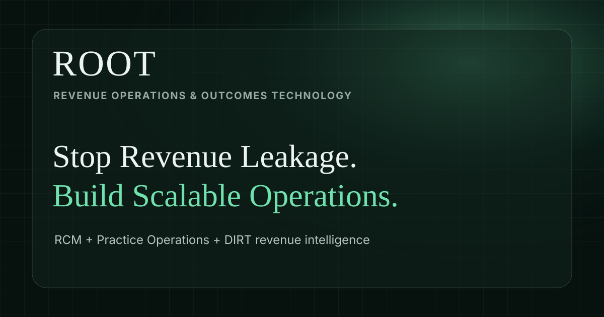
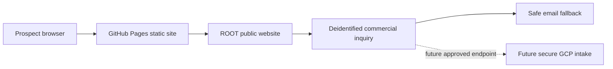
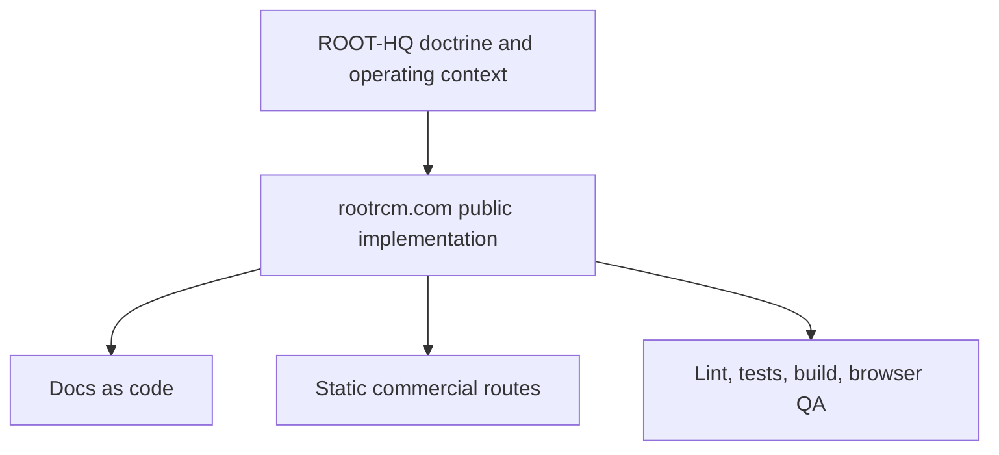

# ROOT Public Website



ROOT is Revenue Operations & Outcomes Technology: a public commercial website for independent US physician practices evaluating a healthcare MSO partner across revenue cycle management, credentialing, practice operations, healthcare IT, workflow automation, analytics, DIRT intelligence, and the fixed-fee Revenue Optimization Diagnostic.

This repository is the deployable static website for `rootrcm.com`. It is built for qualified discovery and Diagnostic opportunities, not PHI intake.

## Positioning

ROOT combines healthcare operations, revenue cycle execution, credentialing, technology enablement, automation, and data intelligence. The initial commercial entry product is the Revenue Optimization Diagnostic, a $2,500 fixed-scope engagement that turns deidentified operating context and approved reports into a prioritized opportunity register and 90-day roadmap. DIRT is the intelligence layer inside ROOT, not the entire company.

## Architecture





## Technology Stack

- React + Vite
- npm and `package-lock.json`
- Vitest + Testing Library
- ESLint
- Static multi-page GitHub Pages build
- CSS design tokens for the Clinical Glass visual system
- Lucide React icons

## Repository Structure

- `src/` - React app, pages, shared data, chrome, inquiry form, and CSS.
- `public/` - static assets copied into `dist-staging`.
- `public/brand/` - brand asset structure and temporary fallback assets.
- `docs/` - architecture, ADRs, design system, SEO, security, QA, and deployment docs.
- Route folders such as `platform/`, `solutions/`, `services/`, `technology/`, `pricing/`, `resources/`, and `diagnostic/` - static HTML entry points for Vite.
- `dist-staging/` - generated production build output.

## Local Development

```bash
npm ci
npm run dev -- --host 127.0.0.1
```

## Validation

```bash
npm run lint
npm test
npm run build
```

The production build output directory is `dist-staging`.

## Static Route Map

- `/`
- `/platform/`
- `/solutions/`
- `/solutions/revenue-leakage/`
- `/solutions/aging-ar/`
- `/solutions/denials/`
- `/solutions/credentialing-bottlenecks/`
- `/solutions/operational-efficiency/`
- `/solutions/reporting-visibility/`
- `/solutions/scaling-practice-ops/`
- `/services/`
- `/diagnostic/`
- `/services/rcm/`
- `/services/medical-billing/`
- `/services/ar-recovery/`
- `/services/denial-management/`
- `/services/payment-posting/`
- `/services/patient-balances/`
- `/services/credentialing/`
- `/services/practice-ops/`
- `/services/healthcare-it/`
- `/services/workflow-automation/`
- `/services/reporting-analytics/`
- `/services/operational-consulting/`
- `/technology/`
- `/technology/dirt/`
- `/pricing/`
- `/resources/`
- `/resources/revenue-leakage-guide/`
- `/resources/aging-ar-playbook/`
- `/resources/denial-management-root-cause/`
- `/resources/credentialing-operations-checklist/`
- `/resources/practice-ops-kpi-model/`
- `/resources/healthcare-automation-readiness/`
- `/company/about/`
- `/contact/`
- `/legal/privacy/`
- `/legal/terms/`
- `/thank-you/`
- `/404.html`

## Deployment Model

GitHub Pages serves the static build. `public/CNAME` must remain `rootrcm.com`. DNS, registrar settings, GitHub Pages production settings, HTTPS enforcement, and production-domain configuration are intentionally out of scope for feature work in this repository.

## ROOT-HQ Relationship

ROOT-HQ is the operating doctrine/specification source. `rootrcm.com` is the public implementation. Read ROOT-HQ for context when available, but do not write to it from this repo.

## GCP Boundary

The public website is static and must not collect PHI. Future secure intake, storage, analytics, or patient-level workflows belong behind approved GCP infrastructure, agreements, access control, audit logging, retention policy, and secret handling.

## Security And No-PHI Rule

No PHI may be committed, placed in examples, submitted through public forms, logged, stored in fixtures, or sent to analytics. Public inquiry flows must remain commercial and deidentified. The required acknowledgement is preserved in the inquiry form.

## Launch Contact

ROOT RCM LLC  
2803 Philadelphia Pike  
Suite B #1864  
Claymont, DE 19703

Phone: +1 (302) 506 4685  
Email: info@rootrcm.com  
WhatsApp: https://wa.me/13025064685

Social/outreach surfaces are present in the UI with coming-soon states until official profile URLs are verified.

## Documentation Index

Start with [docs/README.md](docs/README.md). Key areas:

- [Architecture](docs/architecture/overview.md)
- [ADRs](docs/adr/ADR-001-vite-react-static-site.md)
- [Brand asset inventory](docs/brand/asset-inventory.md)
- [External asset sources](docs/brand/external-asset-sources.md)
- [Experience blueprint](docs/design-system/experience-blueprint.md)
- [Clinical Glass design system](docs/design-system/clinical-glass.md)
- [Imagery direction](docs/design-system/imagery.md)
- [Website route content map](docs/website/route-content-map.md)
- [Service catalog](docs/website/service-catalog.md)
- [Solution architecture](docs/website/solution-architecture.md)
- [Pricing model](docs/website/pricing-model.md)
- [Technical SEO](docs/seo/technical-seo.md)
- [No-PHI security boundary](docs/security/public-site-no-phi-boundary.md)
- [Quality and data protection readiness](docs/security/quality-data-protection-readiness.md)
- [Browser QA checklist](docs/qa/browser-qa-checklist.md)

## Branch And PR Workflow

Work on feature branches, run validation locally, push to the approved branch, and review through PR before merge. Do not work directly on `main`, force-push, merge PRs without approval, or bypass tests.

## Contributor Expectations

Preserve React/Vite, static routing, npm, accessibility, no-PHI boundaries, conservative healthcare claims, and documentation-as-code. Commercial conversion takes precedence over novelty.

## Current Status

Phase 2 platform expansion branch for PR #5. Official brand asset import is blocked until the ChatGPT asset collection files are accessible as original downloadable assets. Fallback assets are clearly marked and replaceable.

## Useful Links

- Production domain: https://rootrcm.com/
- Repository: https://github.com/CoE-DIRT/rootrcm.com
- Draft PR: https://github.com/CoE-DIRT/rootrcm.com/pull/5
