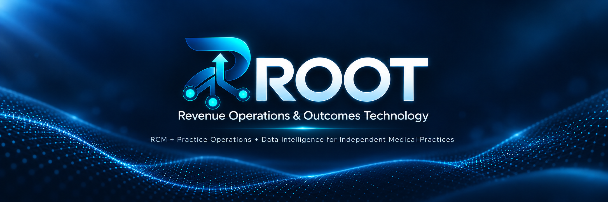
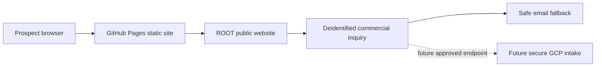
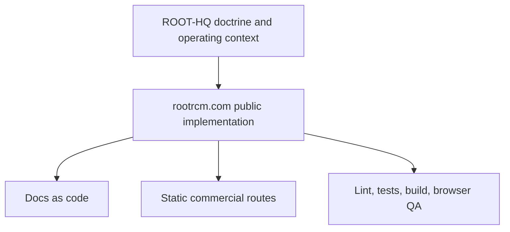

# ROOT Public Website



ROOT is Revenue Operations & Outcomes Technology: the public commercial website for healthcare revenue intelligence and operating infrastructure. It connects managed RCM, credentialing, practice operations, healthcare IT, workflow automation and DIRT intelligence; the fixed-fee Diagnostic is an optional entry engagement.

This repository is the deployable static website for `rootrcm.com`. It is built for qualified discovery and Diagnostic opportunities, not PHI intake.

## Positioning

ROOT connects fragmented healthcare financial data to operational decisions. DIRT — Data Intelligence for Revenue Transformation — is the intelligence capability within ROOT, not a separate company or a finished standalone SaaS product. ROOT pairs that intelligence with managed revenue operations, credentialing as revenue infrastructure, practice operations, and technology. The $2,500 fixed-scope Diagnostic remains a standalone optional entry engagement using deidentified reports.

## Production migration

Appwrite Sites is the approved production destination under ROOT Technology v3. The domain
currently remains on the temporary ChatGPT Site until the destination and contact delivery
are verified. [Migration decision](docs/adr/ADR-008-appwrite-production-hosting.md) and
[release / rollback runbook](docs/deployment/appwrite-cutover.md) supersede older hosting
statements below. The static React/Vite application and `dist-staging` output are retained.

## Architecture (legacy deployment; migration pending)


```mermaid
flowchart LR
  User[Prospect browser] --> Pages[GitHub Pages static site]
  Pages --> Website[ROOT public website]
  Website --> Inquiry[Deidentified commercial inquiry]
  Inquiry --> Email[Safe email fallback]
  Inquiry -. future approved endpoint .-> GCP[Future secure GCP intake]
```


```mermaid
flowchart TB
  HQ[ROOT-HQ doctrine and operating context] --> Public[rootrcm.com public implementation]
  Public --> Docs[Docs as code]
  Public --> Routes[Static commercial routes]
  Public --> QA[Lint, tests, build, browser QA]
```

## Technology Stack

- React + Vite (TypeScript and JavaScript) with npm and `package-lock.json`
- Tailwind CSS v4 tokens and Radix UI primitives over the Clinical Glass design system; Lucide icons
- Vitest + Testing Library (unit and integration), Playwright (browser), ESLint, `tsc --noEmit`
- Static multi-page build to `dist-staging` (compatible with static hosting such as GitHub Pages)
- Klaro for cookie consent; optional, consent-gated analytics (see below)

## Repository Structure

- `src/` - React app, pages, shared data, chrome, inquiry form, and CSS.
- `public/` - static assets copied into `dist-staging`.
- `public/brand/` - brand asset structure and temporary fallback assets.
- `docs/` - architecture, ADRs, design system, SEO, security, QA, and deployment docs.
- Route folders such as `platform/`, `solutions/`, `services/`, `technology/`, `pricing/`, `resources/`, and `diagnostic/` - static HTML entry points for Vite.
- `dist-staging/` - generated production build output.

## Local Development

```bash
npm ci
npm run dev -- --host 127.0.0.1
```

## Validation

```bash
npm run lint
npm test
npx tsc --noEmit
npm run build
git diff --check
```

Browser checks (Playwright) run against local dev servers and stub every external call:

```bash
npx playwright test
```

The production build output directory is `dist-staging`.

## Routes

Every static route is defined once in `src/seo/routeRegistry.js`; the sitemap, robots, page heads and tests are generated from it. The public
navigation is Home, About, Services, Solutions, Case Studies, Pricing, Resources, Contact and the primary call to action. See
[docs/website/sitemap.md](docs/website/sitemap.md) for the full list, including `/book/`, `/faq/`, `/privacy-policy/`, `/terms/`,
`/refund-policy/`, `/thank-you/` and the `404.html` fallback.

## Optional measurement, experiments and payments (all off until configured)

None of these runs, loads a script or stores anything until it is configured **and** the visitor consents. Public configuration only; secrets
never use the `VITE_` prefix and the build refuses secret-shaped `VITE_*` variables (`src/build/envGuard.js`). See `.env.example`.

| Capability | Status | Docs |
| --- | --- | --- |
| Google Analytics 4 | **Disabled**: no Measurement ID supplied (`VITE_GA_MEASUREMENT_ID`) | [docs/analytics/tracking-plan.md](docs/analytics/tracking-plan.md) |
| First-party analytics (Appwrite `tracking-ingest` + private table) | Code, tests and provisioning script ready; **not deployed** | [ADR-009](docs/adr/ADR-009-first-party-analytics-on-appwrite.md), [runbook](docs/deployment/appwrite-analytics.md) |
| A/B experiments | Built; **off in production** unless `VITE_EXPERIMENTS_ENABLED=true`; no results exist | [docs/analytics/experiments.md](docs/analytics/experiments.md) |
| Stripe test-mode checkout | Code and tests ready, **inert**; ADR-010 accepted, awaiting test credentials and preview gates | [ADR-010](docs/adr/ADR-010-stripe-test-mode-checkout.md), [runbook](docs/deployment/stripe-test-mode.md) |
| Search Console, Business Profile | **Not done** (manual owner steps) | [docs/seo/](docs/seo/README.md) |

Appwrite Functions live in `functions/` (`contact`, `tracking-ingest`, `checkout`, `stripe-webhook`); each has its own README. `contact` is the approved
commercial-inquiry relay (ADR-008), `tracking-ingest` is authorized by ADR-009, and the test-mode-only `checkout` and `stripe-webhook` Functions are authorized by ADR-010 but remain undeployed. None of the four is confirmed
deployed from this repository.

## Deployment Model

GitHub Pages serves the static build. `public/CNAME` must remain `rootrcm.com`. DNS, registrar settings, GitHub Pages production settings, HTTPS enforcement, and production-domain configuration are intentionally out of scope for feature work in this repository.

## ROOT-HQ Relationship

ROOT-HQ is the operating doctrine/specification source. `rootrcm.com` is the public implementation. Read ROOT-HQ for context when available, but do not write to it from this repo.

## GCP Boundary

The public website is static and must not collect PHI. Future secure intake, storage, analytics, or patient-level workflows belong behind approved GCP infrastructure, agreements, access control, audit logging, retention policy, and secret handling.

## Security And No-PHI Rule

No PHI may be committed, placed in examples, submitted through public forms, logged, stored in fixtures, or sent to analytics. Public inquiry flows must remain commercial and deidentified. The required acknowledgement is preserved in the inquiry form.

## Launch Contact

ROOT Revenue Operations & Outcomes Technology Incorporated
2803 Philadelphia Pike
Suite B #1864
Claymont, DE 19703

Phone: +1 (302) 506 4685
Email: info@rootrcm.com
WhatsApp: https://wa.me/13025064685

Only verified live outreach channels are rendered publicly. Unverified social/profile destinations remain hidden until official URLs are available.

## Documentation Index

Start with [docs/README.md](docs/README.md). Key areas:

- [Architecture](docs/architecture/overview.md)
- [ADRs](docs/adr/ADR-001-vite-react-static-site.md)
- [Brand asset inventory](docs/brand/asset-inventory.md)
- [External asset sources](docs/brand/external-asset-sources.md)
- [Experience blueprint](docs/design-system/experience-blueprint.md)
- [Clinical Glass design system](docs/design-system/clinical-glass.md)
- [Imagery direction](docs/design-system/imagery.md)
- [Website route content map](docs/website/route-content-map.md)
- [Service catalog](docs/website/service-catalog.md)
- [Solution architecture](docs/website/solution-architecture.md)
- [Pricing model](docs/website/pricing-model.md)
- [Technical SEO](docs/seo/technical-seo.md)
- [No-PHI security boundary](docs/security/public-site-no-phi-boundary.md)
- [Quality and data protection readiness](docs/security/quality-data-protection-readiness.md)
- [Platform readiness register](docs/integrations/platform-readiness.md)
- [Browser QA checklist](docs/qa/browser-qa-checklist.md)

## Branch And PR Workflow

Work on feature branches, run validation locally, push to the approved branch, and review through PR before merge. Do not work directly on `main`, force-push, merge PRs without approval, or bypass tests.

## Contributor Expectations

Preserve React/Vite, static routing, npm, accessibility, no-PHI boundaries, conservative healthcare claims, and documentation-as-code. Commercial conversion takes precedence over novelty.

## Current Status

This repository's production branch is `main`. The 2026 website major revision is in the repository, but Appwrite resources, GA4, Stripe test checkout, and production traffic remain gated by the documented release runbooks. The temporary ChatGPT Sites deployment remains the rollback backup. Approved legal, no-PHI, pricing, and synthetic-proof boundaries remain in force. Canonical public copy: [commercial positioning](docs/website/commercial-positioning-source-of-truth.md). Temporary ChatGPT Site synchronization: [surgical content prompt](docs/website/temporary-chatgpt-site-commercial-upgrade-prompt.md).

## Useful Links

- Production domain: https://rootrcm.com/
- Repository: https://github.com/CoE-DIRT/rootrcm.com
- Launch polish PR: https://github.com/CoE-DIRT/rootrcm.com/pull/6
